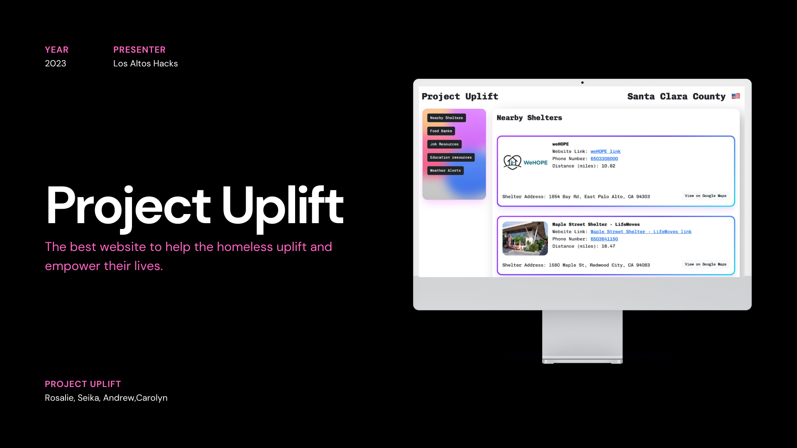

## Devpost Link: [Project Uplift](https://devpost.com/software/project-uplift-sav63x?ref_content=my-projects-tab&ref_feature=my_projects)

Project Uplift is a website that aims to help homeless people find information on nearby food banks, shelters, and other opportunities. Project Uplift also has an opt-in system for text message notifications if the temperature forecast in 24 hours will drop below 45 degrees, alerting homeless to find a shelter before poor weather conditions hit.

